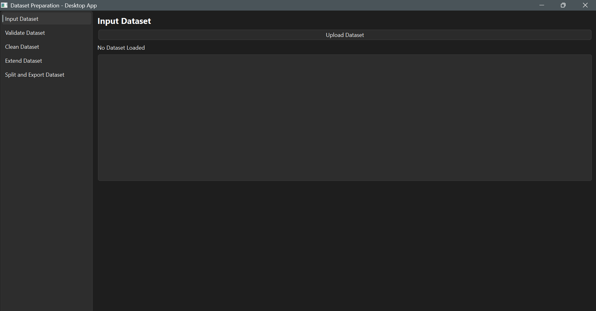
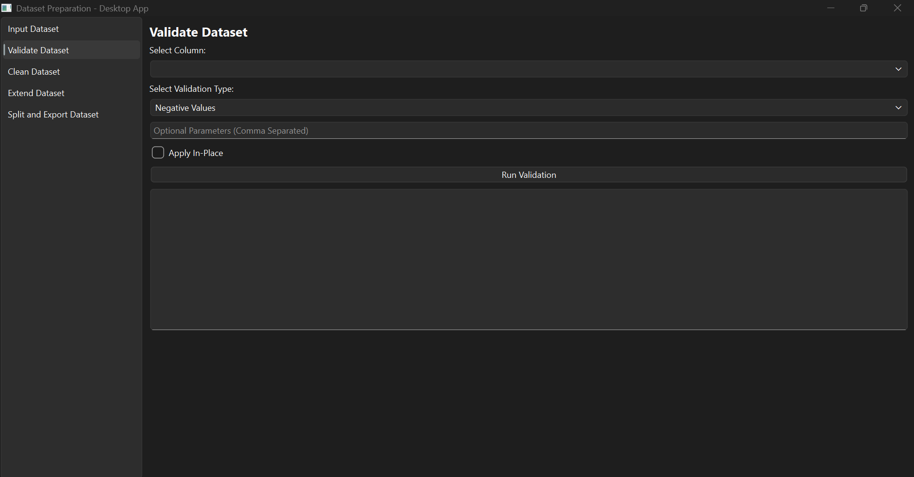
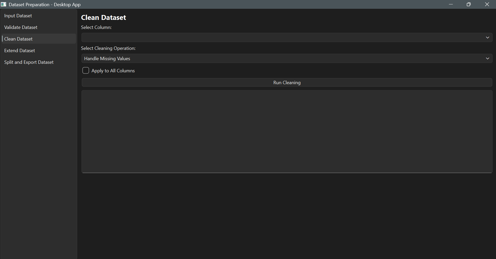
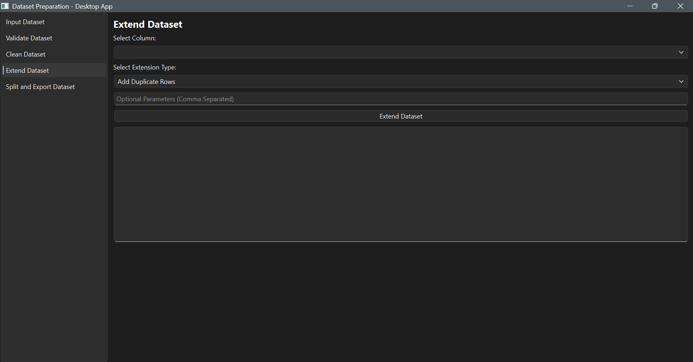
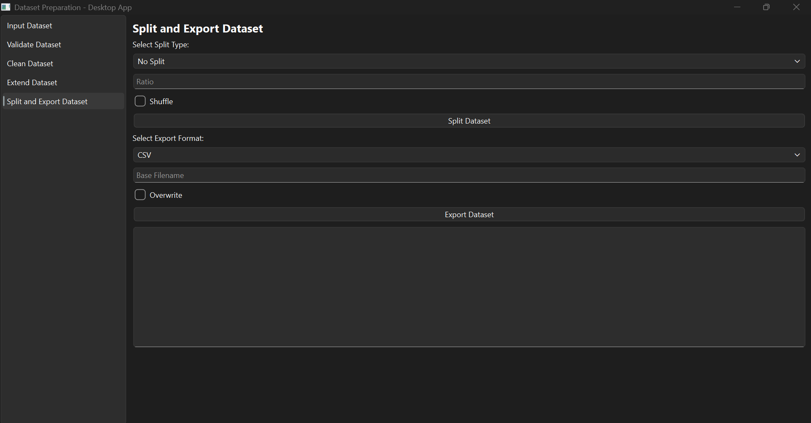

# prepare: Python API and GUI for Dataset Preparation

## Description
prepare is a Python API for users to easily prepare their datasets before any data science, machine learning, or other dataset-related tasks. It is developed purely using Python language and minimal dependencies. The API contains modules for validation, cleaning, extending, splitting, and exporting datasets. 
<br/>
prepareGUI is the graphical user interface built using PyQt. The GUI is built on top of the prepare API, ensuring consistency across both the interfaces. The interface is intuitive and user-friendly.

## Key Features 
- Is a comprehensive tool for preparing datasets before any machine learning or data science operations.
- Contains a modular and structured piepline.
- Can validate and modify inplace, clean, extend, and split datasets.
- Supports import and export of datasets in multiple formats.
- Supports in-memory processing to ensure data privacy.
- Has an intuitive and user-friendly GUI.
- Is lightweight as it is built using minimal dependencies.

## Repository Structure

Dataset-Preparation/<br/>
├── prepare/<br/>
│&nbsp;&nbsp;&nbsp;├── __init__.py<br/>
│&nbsp;&nbsp;&nbsp;├── input.py<br/>
│&nbsp;&nbsp;&nbsp;└── validate.py<br/>
│&nbsp;&nbsp;&nbsp;└── clean.py<br/>
│&nbsp;&nbsp;&nbsp;└── extend.py<br/>
│&nbsp;&nbsp;&nbsp;└── split.py<br/>
│&nbsp;&nbsp;&nbsp;└── export.py<br/>
├── prepareGUI/<br/>
│&nbsp;&nbsp;&nbsp;└── gui.py<br/>
│&nbsp;&nbsp;&nbsp;└── InputPage.py<br/>
│&nbsp;&nbsp;&nbsp;└── ValidatePage.py<br/>
│&nbsp;&nbsp;&nbsp;└── CleanPage.py<br/>
│&nbsp;&nbsp;&nbsp;└── ExtendPage.py<br/>
│&nbsp;&nbsp;&nbsp;└── SplitAndExportPage.py<br/>
├── test_case/<br/>
│&nbsp;&nbsp;&nbsp;└── test.py<br/>
│&nbsp;&nbsp;&nbsp;└── kc_house_data.csv<br/>
│&nbsp;&nbsp;&nbsp;└── Training_Dataset.csv<br/>
│&nbsp;&nbsp;&nbsp;└── TestingDataset.csv<br/>
├── LICENSE<br/>
└── README.md

## prepare API

### input.py
This is the module for taking dataset as input. It contains the Dataset class. Attributes include num_of_rows, num_of_columns, shape, and columns. Functions are given to display head and tail of dataset. The Dataset class can support for the following formats and objects:
- csv file
- json file
- parquet file
- Excel file
- pandas DataFrame

### validate.py
This is the module for validating the dataset and removing faulty rows inplace if user requires the modification. It contains functions to check and remove the rows for the following:
- negative values in a given column
- null values in a given column
- duplicate values in a given column
- invalid class names in a given column
- values outside a given range in a given column
Proper logs are generated to assist the user in the validation process.

### clean.py
This is the module for cleaning the dataset inplace. It contains functions for the following operations:
- handling missing values
- dropping duplicate rows
- handling outliers
- fixing catergorical label names 
- dropping columns
- normalization
- standardization
Proper logs are generated to assist the user in the cleaning process.

### extend.py
This is the module for extending the rows of the dataset. It contains functions to support the following types of row additions:
- addition of duplicate rows
- addition of Gaussian rows
- addition of nosiy rows
- addition of rows to help balance classes
Proper logs are generated to assist the user in extending the dataset.

### split.py
This is the module for splitting and optionally shuffling the dataset. It contains functions to support the following kinds of splits:
- no splitting
- splitting the dataset into `train` and `test` datasets
- splitting the dataset into `train`, `validate`, and `test` datasets
Proper logs are generated to assist the user in splitting the dataset.

### export.py
This is the module for exporting the dataset in the desired format(s) and allows overwriting files if user requires it. It contains support for the following formats and objects:
- csv file
- json file
- parquet file
- Excel file
- pandas DataFrame

## prepareGUI
prepareGUI is a GUI built on top of prepare for users who prefer a visual interface. It mirrors the API functionality and has a provision to display logs as well. The GUI is intuitive and user-friendly. THe visuals are as follows:<br/>

### Input Dataset Section



### Validate Dataset Section



### Clean Dataset Section



### Extend Dataset Section



### Split and Export Dataset Section




## License Information
This project is licensed under the terms of the GNU Lesser General Public License, Version 2.1. More information regarding it may be read in LICENSE file.

## Sample Code using prepare
```
from prepare.input import Dataset
from prepare.validate import Validator
from prepare.clean import Cleaner
from prepare.extend import Extender
from prepare.split import Splitter
from prepare.export import Exporter

dataset = Dataset("test_case/kc_house_data.csv")

validator = (
    Validator(dataset, inplace = False)
    .negative_values("floors")
    .null_values("floors")
    .duplicate_values("id")
    .validate_range("bathrooms", 1)
)

cleaner = (
    Cleaner(dataset)
    .handle_missing_values(all_columns = True)
    .handle_outliers(all_columns = True)
    .fix_categoricals(all_columns = True)
    .drop_column("id")
    .drop_column("date")
    .drop_duplicate_rows()
    .normalize(all_columns = True)
    .standardize(all_columns = True)
)

extender = (
    Extender(dataset)
    .add_gaussian_rows()
    .add_duplicate_rows()
    .add_noisy_rows()
)

splitter = Splitter(dataset)
result = splitter.train_test(0.8)

exporter = Exporter()
exporter.export_to_csv(result["train"], "test_case/Training_Dataset.csv", overwrite = False)
exporter.export_to_csv(result["test"], "test_case/Testing_Dataset.csv", overwrite = False)
```
